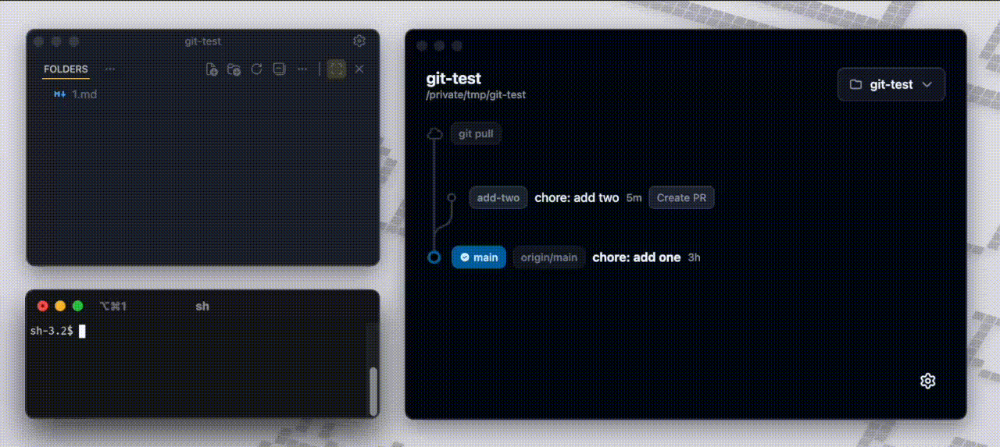

<div align="center">
  <h1>Teapot</h1>
  <p><strong>View & manage your stacked diffs like Lego bricks</strong></p>

[](https://github.com/jhleao/teapot/actions/workflows/release.yml)
[](https://github.com/jhleao/teapot/releases)
[](https://github.com/jhleao/teapot/releases)
[](https://github.com/jhleao/teapot/commits/main)
[](LICENSE)

</div> 

---

<p align="center"></p>

## About

Teapot makes stacked diff workflows so easy you barely have to think about it. It shows your branches as a visual tree, helps you reshape stacks with drag and drop, and keeps frequent Git and GitHub actions handy, while being transparent enough so that nothing feels like incomprehensible magic (don't we all hate that?!).

Large rebases often fail/conflict halfway through. Teapot runs rebases as an interactive durable queue. Pauses on conflicts, and lets you resolve and resume without losing the large stack-wide rebasing plan. Most of the time, this means a couple of mouse clicks and less than 3 seconds.

For each branch in the stack, Tepot trackes the remote PR linked to it. Offers to create a PR with base branch detection, and to update a PR after amends with a force push. Teapot highlights out of sync branches and stale targets. No more half-rebased stacks, no more commits pointing at stale parents (bogus stack bifurcation). Stacks stay healthy and the whole state stays obvious.

## Installation

### macOS

1. Download the latest release from [Releases](https://github.com/jhleao/teapot/releases)
2. Open the downloaded DMG and drag `teapot.app` to Applications

> **Note:** macOS will show a security warning because the app is not code-signed yet. Run this once to bypass:
>
> ```bash
> xattr -c /Applications/teapot.app
> ```

### Windows

1. Download `teapot-[version]-setup.exe` from [Releases](https://github.com/jhleao/teapot/releases)
2. Run the installer and follow the wizard

### Linux

1. Download the AppImage from [Releases](https://github.com/jhleao/teapot/releases)
2. Make it executable and run:
   ```bash
   chmod +x teapot-*.AppImage && ./teapot-*.AppImage
   ```

## How It Works

Teapot uses **stacked branches**. Instead of one big PR with hundreds of changes, you break your work into small branches that build on each other:

```
main
 └── feature/auth-types      ← PR #1 (ready to merge)
      └── feature/auth-api   ← PR #2 (in review)
           └── feature/auth-ui   ← PR #3 (draft)
```

Each branch has one focused change. Reviewers see small diffs. Reviews go faster.

### The workflow

1. Create a branch for each logical change
2. Stack branches on top of each other
3. Open a PR for each branch
4. Merge from the bottom up (several trunk merges, instead of a large one)
5. Amend commits instead of adding new ones when iterating on a branch (i.e. phase)

Small PRs get reviewed quickly. You ship code while the next piece is still in review. Your git history stays clean.

## Contributing

Found a bug or have an idea? [Open an issue](https://github.com/jhleao/teapot/issues).

## Acknowledgments

Teapot is inspired by [Superlog](https://superlog.dev/), a fantastic tool that introduced many developers to the stacked branches workflow. With Superlog no longer actively maintained, Teapot aims to carry the torch as an open-source alternative.

## License

[MIT](LICENSE)
